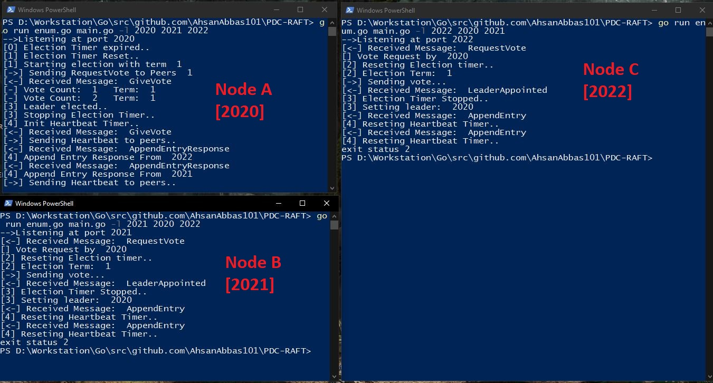
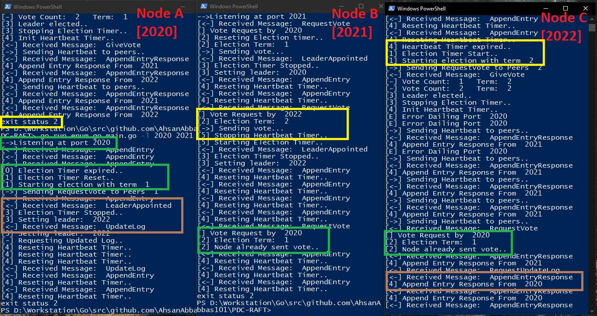
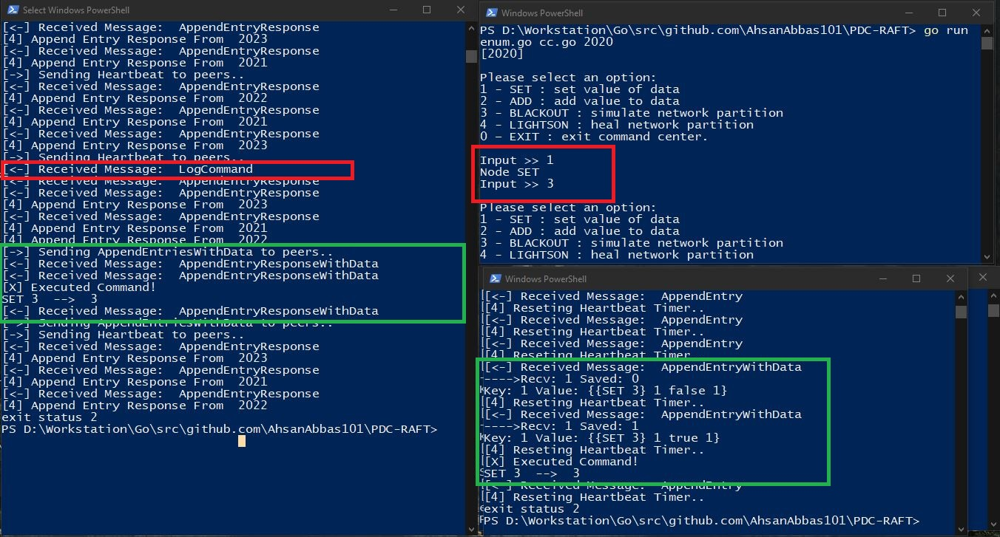
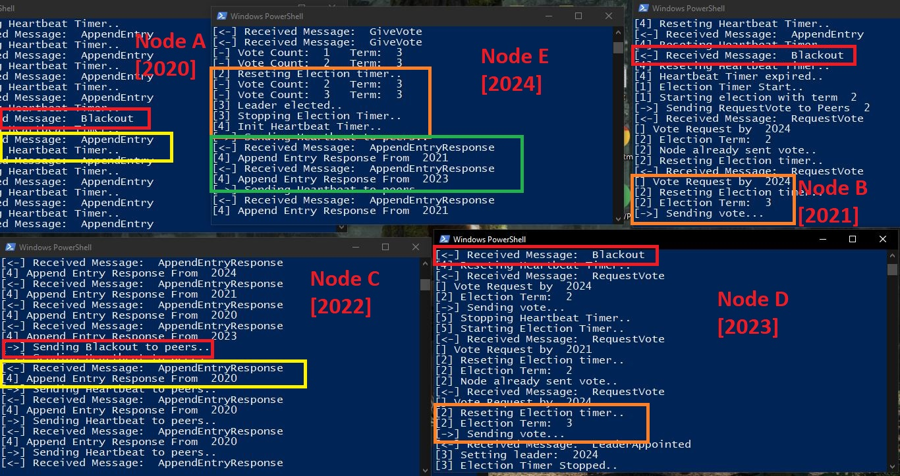
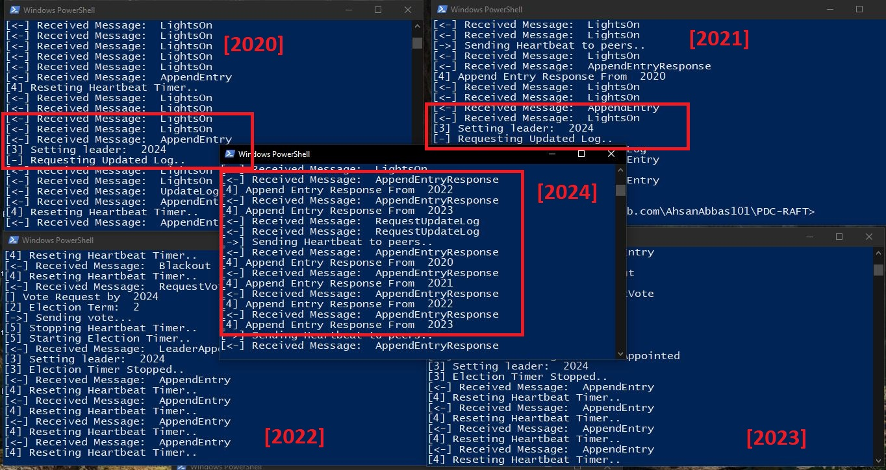
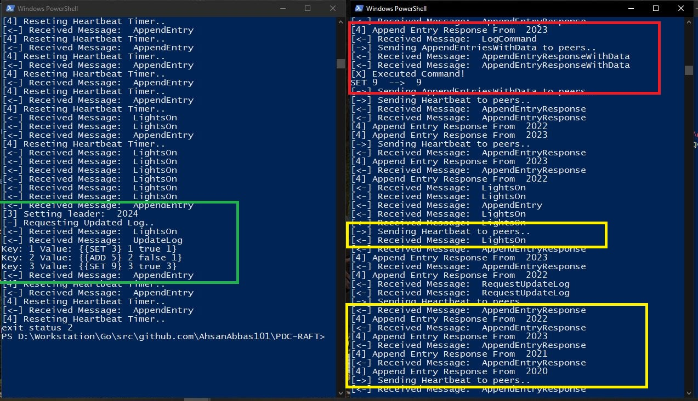

# RAFT
RAFT consensus algorithm implemetation in Go. 

## Execution

To execute the program:
```
go run enum.go main.go -l <Port to listen> <peer node> <peer node>
```
e.g
``` 
go run enum.go main.go -l 2020 2021 2022 2023
```

To send commands to the leader node, execute
```
go run enum.go cc.go <Leader port>
```

## Execution Logs

### Leader Election

#### Normal Execution



* Node A timer expires
* Node A starts election with term 1
* Node A sends RequestVote message to peers
* Node B & C receives RequestVote and cast vote by sending GiveVote message
* Node B & C reset their election timers
* Node A after receiving GiveVote messages, achieves majority, becomes leader, stops election timer and starts heartbeat timer.
* Node A sends AppendEntry messages to Node B & C
* Node B & C respond to AppendEntry message with AppendEntryResponse messages.

#### With Leader Node down



1.	Color Yellow [ Node Failure]
    * After Leader election, Node A exits. 
    * Heartbeat timer for Node C expires, and it starts election with new term
    * Node B receives vote request for term 2. Node B sends votes
    * Node C becomes leader, informs B
2.	Color Green [ Node Recover]
    * Node A election timer expires, starts election
    * Node B & C already voted for the term. 
3.	Color Brown [ Finalize]
    * Node C [leader] informs Node A of new term leader and also sends updated log
    * Node A sets new leader and starts receiving Append Entries from Node C


### Log Replication

#### Log Update



1.	Color Red
    * A LogCommand is send using separate program to leader
2.	Color Green
    * Leader appends the command with append entries and sends to peers
    * Peers update log and send response
    * After majority response, Leader send commit Boolean with appendEntry
    * Each node commits changes to data 

#### Partition



1.	Color Red
    * From cc.go , Blackout command is send to leader Node C.
2.	Color Yellow
    * Node C corresponds only to Node A
3.	Color Orange
    * Node E timeouts and starts election
4.	Color Green
    * Node B & D follow Node E
Partition achieved.

#### Partition Heal



* LightsOn command is send to leader from cc.go
* Nodes with less election term sets leader i.e 2024
* New Leader sends updated log to reflect any changes during partition


#### Consistency



1.	Color Red
    * Value 9 is set in partition and agreed upon
2.	Color Yellow
    * Netowrk heals with LightsOn command
3.	Color Green
    * New leader is set for previous term nodes
    * Updated Log is send by the leader


## Resource
http://thesecretlivesofdata.com/raft/